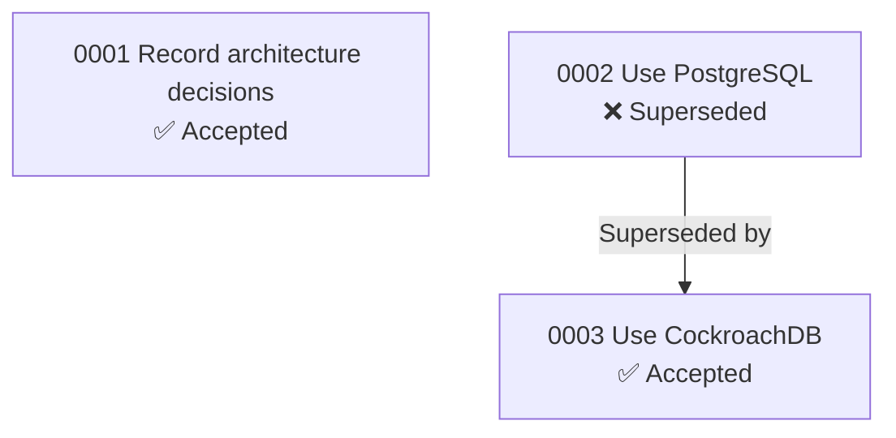

# adr-tools CLI Reference & Bash Fallbacks

`adr-tools` is a command-line toolset by Nat Pryce for managing Architecture Decision Records (ADRs) as lightweight Markdown documents in a project repository.

**Repository:** https://github.com/npryce/adr-tools

**Important:** If `adr-tools` is not installed, every operation has a bash/file-manipulation fallback. Always check first:

```bash
command -v adr >/dev/null 2>&1 && echo "available" || echo "not available"
```

## Installation

### Homebrew (macOS/Linux)

```bash
brew install adr-tools
```

### Manual Installation

```bash
git clone https://github.com/npryce/adr-tools.git
# Add the src/ directory to your PATH
export PATH="$PATH:/path/to/adr-tools/src"
```

## Commands & Bash Fallbacks

### Initialize — `adr init [directory]`

**With adr-tools:**
```bash
adr init doc/adr
```

**Bash fallback:**
```bash
mkdir -p doc/adr
# Create the first ADR manually using the Write tool
```

---

### Create new ADR — `adr new [-s SUPERSEDED] "Title"`

**With adr-tools:**
```bash
adr new "Use PostgreSQL for persistent storage"
# Creates: doc/adr/NNNN-use-postgresql-for-persistent-storage.md

# Supersede an existing ADR
adr new -s 5 "Use CockroachDB instead of PostgreSQL"
```

**Bash fallback:**
```bash
# 1. Find next number
NEXT=$(printf "%04d" $(($(ls doc/adr/ | grep -oE '^[0-9]+' | sort -n | tail -1) + 1)))

# 2. Generate filename
TITLE="use-postgresql-for-persistent-storage"
FILE="doc/adr/${NEXT}-${TITLE}.md"

# 3. Create file using the Write tool with the Nygard template content
```

When superseding (bash fallback):
1. Create the new ADR with a note in Status: `Supersedes [N. Old Title](old-file.md)`
2. Edit the old ADR's Status section to: `Superseded by [N. New Title](new-file.md)`

**Flags:**
- `-s NUMBER` — Mark the new ADR as superseding ADR `NUMBER`. Updates the old ADR's status automatically.
- `-l TARGET:LINK:REVERSE` — Create a link between the new ADR and `TARGET`.

**Behavior:**
- Auto-numbers the ADR sequentially (0001, 0002, ...)
- Converts the title to a lowercase-hyphenated filename
- Opens the file in `$VISUAL` or `$EDITOR` if set

---

### List ADRs — `adr list`

**With adr-tools:**
```bash
adr list
```

**Bash fallback:**
```bash
ls -1 doc/adr/*.md | sort
```

To get titles:
```bash
for f in doc/adr/*.md; do head -1 "$f"; done
```

---

### Link ADRs — `adr link SOURCE LINK TARGET REVERSE_LINK`

**With adr-tools:**
```bash
adr link 12 "Amends" 10 "Amended by"
```

**Bash fallback:**
Use the Edit tool to append link lines to the Status section of both ADRs:

In ADR 12's Status section, add:
```
Amends [10. Title of ADR 10](0010-title-of-adr-10.md)
```

In ADR 10's Status section, add:
```
Amended by [12. Title of ADR 12](0012-title-of-adr-12.md)
```

Common link types:
- `Amends` / `Amended by`
- `Supersedes` / `Superseded by`
- `Depends on` / `Depended on by`
- `Related to` / `Related to`
- `Extends` / `Extended by`
- `Conflicts with` / `Conflicts with`

---

### Generate Table of Contents — `adr generate toc`

**With adr-tools:**
```bash
adr generate toc
```

**Bash fallback:**
```bash
echo "# Architecture Decision Records"
echo ""
for f in doc/adr/*.md; do
  NUM=$(basename "$f" | grep -oE '^[0-9]+' | sed 's/^0*//')
  TITLE=$(head -1 "$f" | sed 's/^# [0-9]*\. //')
  echo "* [${NUM}. ${TITLE}]($(basename "$f"))"
done
```

Or generate a table format with status and date:
```bash
echo "| # | Title | Status | Date |"
echo "|---|-------|--------|------|"
for f in doc/adr/*.md; do
  NUM=$(basename "$f" | grep -oE '^[0-9]+' | sed 's/^0*//')
  TITLE=$(head -1 "$f" | sed 's/^# [0-9]*\. //')
  STATUS=$(grep -A1 "^## Status" "$f" | tail -1 | xargs)
  DATE=$(grep "^Date:" "$f" | sed 's/Date: //')
  echo "| ${NUM} | [${TITLE}]($(basename "$f")) | ${STATUS} | ${DATE} |"
done
```

---

### Generate Relationship Graph — Mermaid

**Note:** `adr generate graph` outputs Graphviz DOT format. Mermaid is often more convenient since it renders in Markdown. The example below uses Mermaid.

`adr generate graph` outputs Graphviz DOT format. Instead, generate Mermaid directly by parsing ADR Status sections:

**Bash — extract relationships:**
```bash
for f in doc/adr/*.md; do
  NUM=$(basename "$f" | grep -oE '^[0-9]+' | sed 's/^0*//')
  TITLE=$(head -1 "$f" | sed 's/^# [0-9]*\. //')
  STATUS=$(grep -A1 "^## Status" "$f" | tail -1 | xargs)
  echo "ADR${NUM}: ${TITLE} [${STATUS}]"
  # Extract links from Status section
  grep -E "^(Superseded by|Supersedes|Amends|Amended by|Depends on|Related to)" "$f" 2>/dev/null | while read -r line; do
    echo "  -> ${line}"
  done
done
```

Then construct a Mermaid diagram:


Status indicators for Mermaid nodes:
- ✅ Accepted
- 📝 Proposed
- ❌ Superseded
- 🗄️ Deprecated

---

### Search ADRs by keyword

**Bash:**
```bash
# Search all ADR content
grep -ril "<keyword>" doc/adr/

# Search titles only
grep -l "<keyword>" doc/adr/*.md | head -1 | xargs head -1

# Search by status
grep -rl "^Proposed$" doc/adr/
grep -rl "^Accepted$" doc/adr/
grep -rl "^Superseded" doc/adr/
```

---

### Find stale Proposed ADRs

**Bash:**
```bash
for f in doc/adr/*.md; do
  STATUS=$(grep -A1 "^## Status" "$f" | tail -1 | xargs)
  if [ "$STATUS" = "Proposed" ]; then
    DATE=$(grep "^Date:" "$f" | sed 's/Date: //')
    echo "$(basename "$f"): Proposed since ${DATE}"
  fi
done
```

## Configuration

### ADR Directory

By default, `adr-tools` stores ADRs in `doc/adr/`. This is configured during `adr init`. The tool stores its config in `.adr-dir` at the project root.

### Templates

`adr-tools` uses a default Markdown template for new ADRs. This skill uses the Michael Nygard template defined in `references/nygard-template.md` instead.

## File Naming Convention

ADRs follow the pattern: `NNNN-title-in-lowercase-with-hyphens.md`

- `NNNN` — Zero-padded sequential number (0001, 0002, ...)
- Title words separated by hyphens
- All lowercase
- `.md` extension

## Status Values

Standard status values used in ADRs:

- **Proposed** — Decision is under discussion, not yet agreed upon
- **Accepted** — Decision has been agreed upon and is in effect
- **Deprecated** — Decision is no longer relevant but kept for historical context
- **Superseded by [ADR-NNNN](NNNN-title.md)** — Replaced by a newer decision
