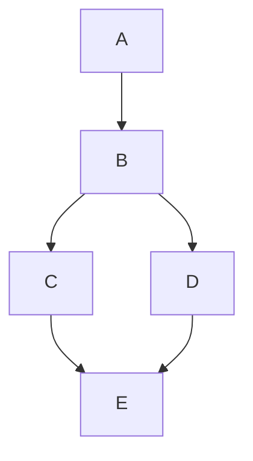
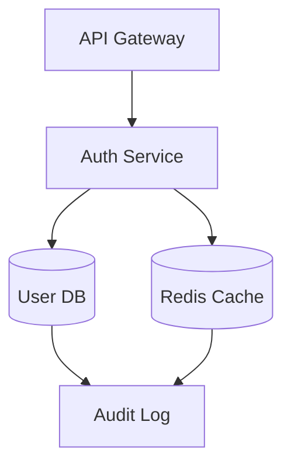
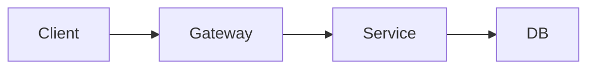
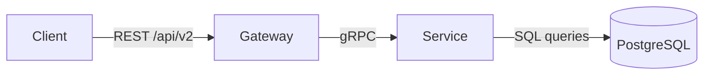
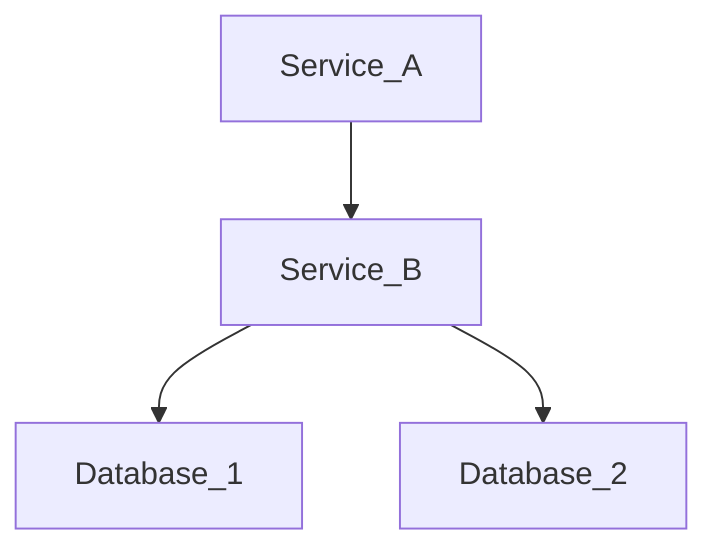
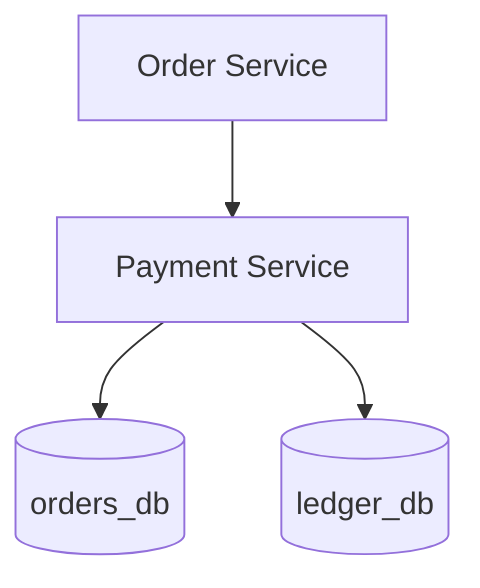
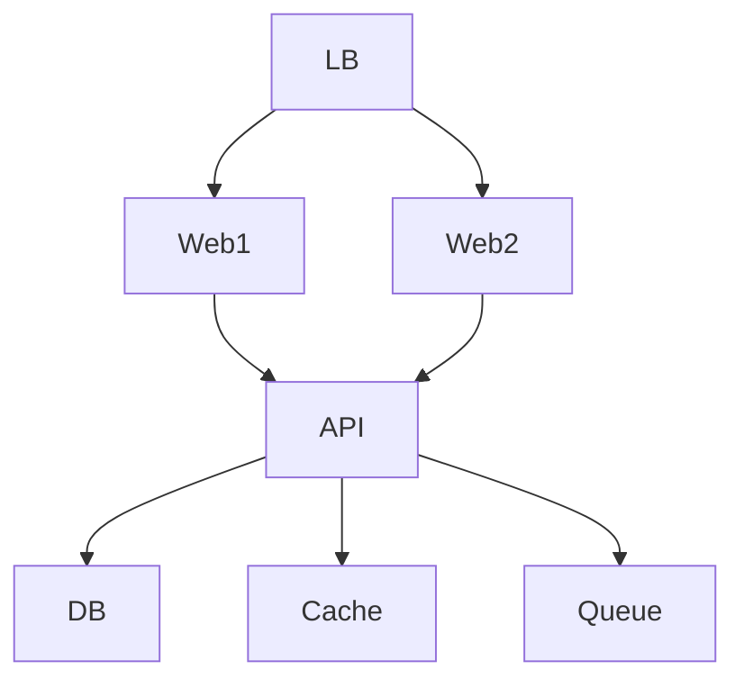
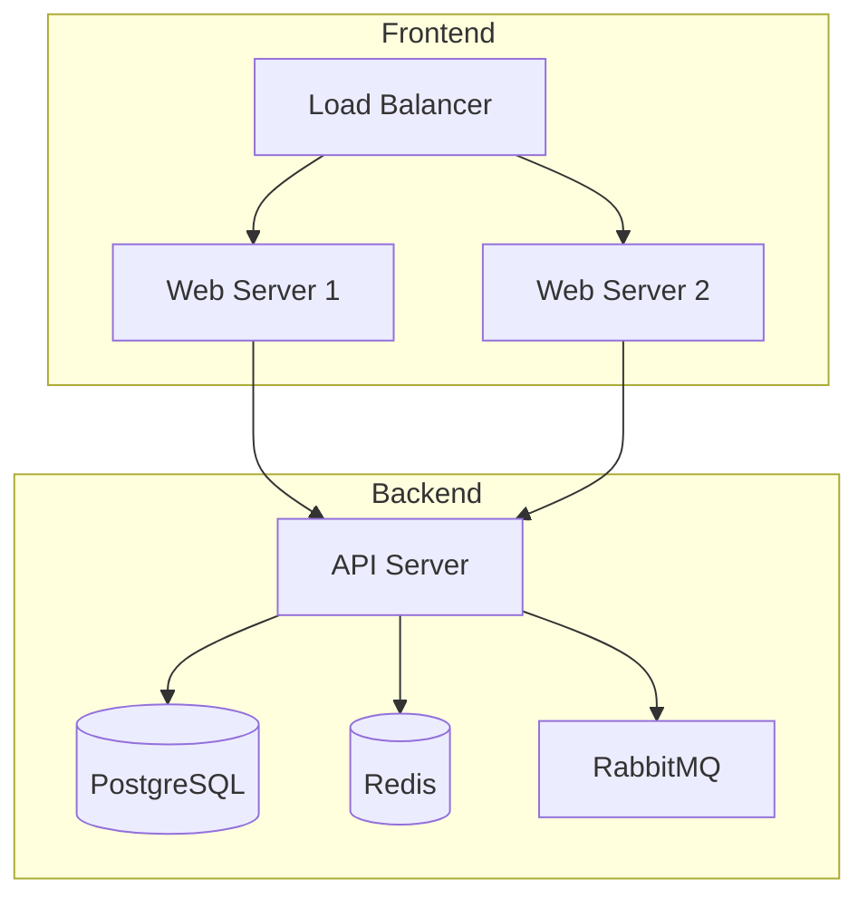

# Diagram-as-Code AI Patterns

Patterns specific to AI-generated diagrams, with Mermaid-specific examples and tool-agnostic principles. Apply when content type is `diagram` or when diagram code blocks are detected in `mixed` content.

## Mermaid-Specific Patterns

### D1. Single-Letter Node IDs Without Labels

**Problem:** AI generates minimal node IDs that carry no meaning.

**Before:**

**After:**

### D2. Over-Styled Before Structured

**Problem:** AI adds classDef, styling, and theme directives before the diagram structure makes sense. Style without substance.

**Fix:** Get the structure and labels right first. Add styling only when it serves communication (e.g., color-coding error paths vs. happy paths).

### D3. Too Many Nodes in One Diagram

**Problem:** AI dumps an entire system into one diagram with 15+ nodes, making it unreadable.

**Fix:** Split into focused sub-diagrams. One diagram per concept: "auth flow", "data pipeline", "deployment topology." If you can't explain the diagram in one sentence, it's too big.

### D4. Missing Edge Labels

**Problem:** Arrows with no context — the reader has to guess what the relationship means.

**Before:**

**After:**

### D5. Generic Placeholder Labels

**Problem:** AI uses "Service A", "Component 1", "Module X" instead of real names from the system.

**Before:**

**After:**

### D6. No Subgraph Grouping

**Problem:** Flat structure for complex systems — everything at the same level with no visual hierarchy.

**Before:**

**After:**

## Tool-Agnostic Principles

### D7. Inconsistent Direction

**Problem:** Mixing LR and TD (or left-right and top-down) within a single diagram without reason.

**Fix:** Pick one direction per diagram. Use TD for hierarchies and flow-down processes. Use LR for timelines, sequences, and pipelines.

### D8. AI-Generated Diagram Narration

**Problem:** Surrounding prose over-explains what the diagram already shows.

**Watch for:** "As illustrated in the diagram below", "The following diagram shows", "As we can see from the diagram"

**Fix:** Let the diagram speak for itself. Add prose only for context the diagram can't convey — the *why*, not the *what*. A caption with one sentence of context is better than a paragraph restating every node.

**Before:**
> As illustrated in the diagram below, the API Gateway receives requests from clients and forwards them to the Auth Service, which then validates the user's credentials against the User Database. If validation succeeds, the request is passed to the Order Service.

**After:**
> Auth happens at the gateway level so downstream services never handle raw credentials:
>
> [diagram]

## Reference

Compiled from: docsie.io (Mermaid best practices), direct observation of AI-generated diagrams, and general diagramming principles from software architecture documentation.
